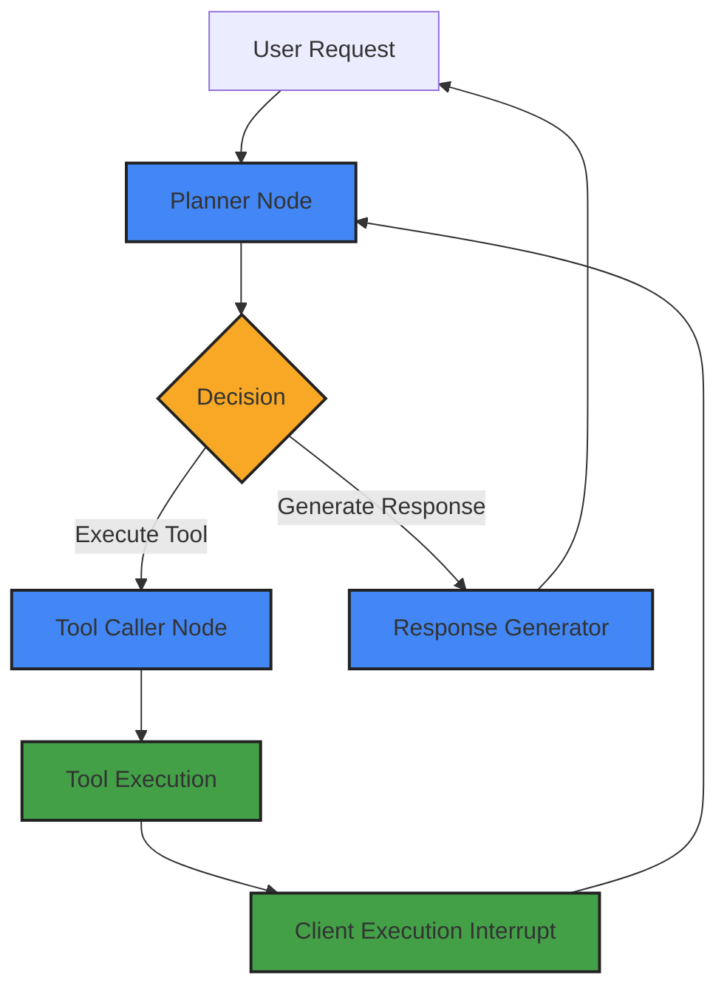

<p align="center">
  
</p>

<h1 align="center">Seren AI - LangGraph Agent Architecture</h1>

<p align="center">
  
  
  
  
  
</p>

## Project Overview

The Seren AI LangGraph backend implements an advanced agent orchestration system that powers voice-controlled business operations in the Seren AI productivity suite. This repository contains a multi-node reasoning engine capable of converting natural language requests into structured actions that manipulate the client application state directly, creating a seamless voice-control experience.

Key technical achievements include implementing a recursive reasoning architecture with intelligent error handling, type-safe tool execution, and conversational response times using optimized LLM configurations through Groq with Llama-3-70B models.

## Architecture Overview



The LangGraph agent implements a multi-node architecture that seamlessly integrates with the Flutter client through a client-side interrupt pattern. This enables the AI to access real-time application state and execute actions using a flexible set of domain-specific tools.

Data flows from the user's voice command through the planning system, which makes intelligent decisions about whether to execute tools or generate responses. The system maintains conversational coherence through a comprehensive state management system.

## Core Components

### Planning System (`src/nodes/node_planner.py`)

The Planning node serves as the central orchestrator, making strategic decisions about workflow execution:

- **Responsibilities**: Analyzes user requests, determines required actions, tracks execution progress
- **Key Interface**: `PlannerDecision` with structured fields for plan tracking and next node routing
- **Design Pattern**: Implements a stateful decision-making pattern with iteration control

### Tool Execution System (`src/nodes/node_tool_caller.py` & `src/tools/`)

The Tool Caller node interfaces with the comprehensive tool library to execute operations:

- **Responsibilities**: Converts plan instructions into executable tool calls, handles errors, provides feedback
- **Key Interfaces**: Domain-specific tool libraries for tasks, notes, and shifts
- **Design Pattern**: Uses typed function annotations and Pydantic models for validation

### Response Generation (`src/nodes/node_response_generator.py`)

The Response Generator node creates user-facing natural language responses:

- **Responsibilities**: Synthesizes execution results into coherent responses
- **Key Interfaces**: Formats messages for optimal user experience
- **Design Pattern**: Context-aware response templating with language personalization

### Client Execution Bridge (`node_execute_ai_request_on_client`)

A critical innovation that enables direct manipulation of client-side state:

- **Responsibilities**: Transfers execution from server to client through an interrupt pattern
- **Key Interfaces**: Structured request models for client-side operations
- **Design Pattern**: Server-client bridge with structured command serialization

## Business Domain Tools

Seren AI implements a comprehensive set of domain-specific tools that enable rich interactions with the business application:

### Task Management Tools (`src/tools/task_tools.py`)

```python
# Create new tasks with rich metadata
create_task(task_name, task_description, task_due_date, task_priority, assigned_user_names, ...)

# Find tasks based on various criteria
find_tasks(task_name, task_status, task_priority, task_due_date_start, task_due_date_end, ...)

# Update task properties
update_task_fields(task_id, task_name, task_status, task_priority, assigned_user_names, ...)

# Task interaction
add_comment_to_task(task_id, task_name, comment)
show_tasks(task_type, task_id, task_name, parent_project_name)
```

### Note Management Tools (`src/tools/note_tools.py`)

```python
# Create and manage notes
create_note(note_title, note_content, parent_project_name, ...)
update_note(note_id, note_title, note_content, ...)
share_note(note_id, share_with_user_names, ...)

# Find and display notes
find_notes(note_title, note_content, author_user_name, ...)
show_notes(note_id, note_title, ...)
```

### Shift Management Tools (`src/tools/shift_tools.py`)

```python
# Shift operations
toggle_clock_in_or_out()

# Shift information retrieval
get_current_shift()
get_shift_assignments()
get_shift_logs(date_start, date_end, ...)
```

These tools provide a comprehensive interface for the AI agent to interact with the business application, enabling complex operations through voice commands.

## Engineering Challenges & Solutions

### Conversational Response Speed

**Problem**: Achieving conversational response times with advanced reasoning capabilities

**Solution**: Implemented a Groq integration with Llama-3-70B models, optimizing system prompts and token usage while maintaining reasoning quality. This delivers response times fast enough for natural conversation while maintaining sophisticated reasoning patterns.

### Multi-Step Reasoning with Client Execution

**Problem**: Completing multi-step operations that require interleaving server-side reasoning with client-side execution

**Solution**: Developed a novel interrupt-based pattern where the LangGraph workflow pauses during client execution, then resumes with execution results, creating a seamless integration between client and agent.

```python
def node_execute_ai_request_on_client(state: AgentState):
    # Interrupt flow, waiting for client execution results
    ai_request_result = interrupt("Provide client ai request execution result:")
    
    # Update message with execution results and continue flow
    messages = state["messages"]
    last_message = messages[-1]
    updated_message = ToolMessage(
        content=ai_request_result,
        tool_call_id=getattr(last_message, "tool_call_id", None),
        id=last_message.id if hasattr(last_message, "id") else None,
    )
    return {"messages": [updated_message], "prev_node_feedback": ""}
```

### Type-Safe Tool Execution

**Problem**: Ensuring reliable tool execution with proper validation and error recovery

**Solution**: Implemented a comprehensive type system using Pydantic models and Python's Annotated type hints, providing precise validation and clear error messages for recovery.

### Stateful Reasoning Across Turns

**Problem**: Maintaining coherent reasoning across multiple conversation turns

**Solution**: Developed a structured state management system using TypedDict with explicit typing, properly tracking context, plans, and execution history.

## Local Development Setup

For detailed setup instructions, environment configuration, and contributing guidelines, please refer to:

- [**CONTRIBUTING.md**](CONTRIBUTING.md) - Complete development environment setup and workflow


## Related Repositories

This LangGraph agent is part of the larger Seren AI ecosystem:

- **[Flutter Client](https://github.com/fjnoyp/seren_ai_flutter)** - Cross-platform mobile and web UI
- **[Supabase Backend](https://github.com/fjnoyp/seren_ai_supabase)** - Data persistence and Edge Functions

## Contributors

- **Kyle Cheng** - [GitHub](https://github.com/fjnoyp) | [LinkedIn](https://www.linkedin.com/in/kylecheng/) - Lead Developer and Architect

